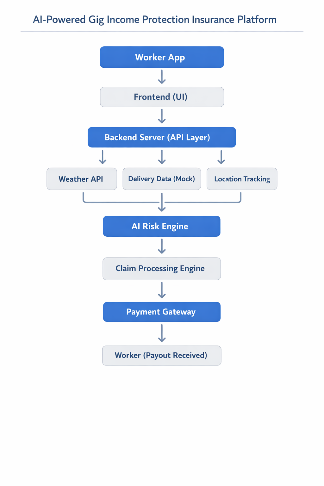

# AI-Powered Gig Income Protection

##  Problem
Delivery workers lose income during extreme weather conditions like heavy rain and heat.

##  Solution
We built a smart micro-insurance system that automatically compensates workers when weather affects their income.

## ⚙️ Features
- User Registration
- Plan Selection (Basic, Standard, Premium)
- Real-time Weather Detection
- Automated Claim System
- Instant Payout Simulation

## Architecture

##  Tech Stack
- Frontend: React.js
- Backend: Node.js, Express
- API: Open-Meteo Weather API

##  Demo
[(Add your video link here)](https://drive.google.com/file/d/1H_OQUpjO3tQnls02BrglkmM3PtB6MLO6/view?usp=sharing)

##  Future Scope
- Real payment integration
- AI-based risk prediction
- Mobile application
